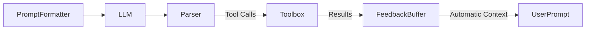

# Feedback Tools Implementation Guide

## Design Philosophy (Revised)

Feedback tools follow three core principles:
1. **Zero-Overhead Feedback**: Tool results automatically flow back to LLM context
2. **Circular Buffer Storage**: Keep last N results to prevent context overload
3. **Implicit Context Injection**: Results appear naturally in subsequent prompts

## Architecture
 


New key components:
- **FeedbackBuffer**: Thread-safe ring buffer storing last N results
- **ResponseFormatter**: Converts tool outputs to natural language snippets

## Implementation Pattern

1. **Implicit Feedback Capture** - Tools return values automatically stored:
```python
def research_tool(query: str):
    results = fetch_data(query)
    return f"Found {len(results)} items about {query}"
```

2. **Transparent Context Injection** - Formatters handle feedback display:
```python
class EnhancedXMLFormatter(XMLPromptFormatter):
    def format_history(self, feedback: FeedbackBuffer) -> str:
        return "\n".join(f"<result>{item}</result>" for item in feedback.last(3))
```

3. **Execution Flow** - Agent loop manages context lifecycle:
```python
def agent_loop():
    events = process_llm_response()
    for event in events:
        result = toolbox.use(event)
        if result:
            feedback.add(format_result(result))
```

## Example 04: Modern Research Assistant

```python
from ai_agent_toolbox import Toolbox, XMLParser, XMLPromptFormatter
from ai_agent_toolbox import FeedbackBuffer
from examples.util import anthropic_llm_call

# Core components
feedback = FeedbackBuffer(capacity=3)
toolbox = Toolbox()
parser = XMLParser(tag="tool")
formatter = XMLPromptFormatter().with_feedback(feedback)

# Simple search tool
toolbox.add_tool(
    name="search", 
    fn=lambda query: f"Results for {query} (demo)",
    args={"query": "string"}, 
    description="Search academic databases"
)
```